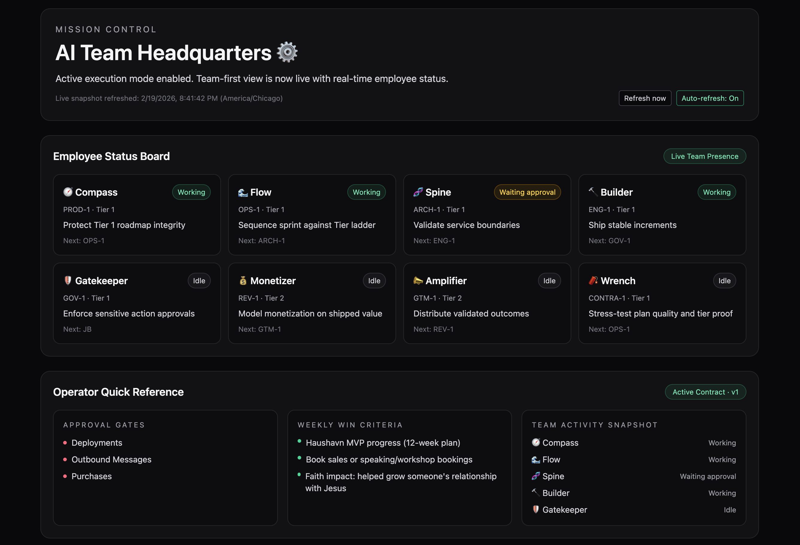
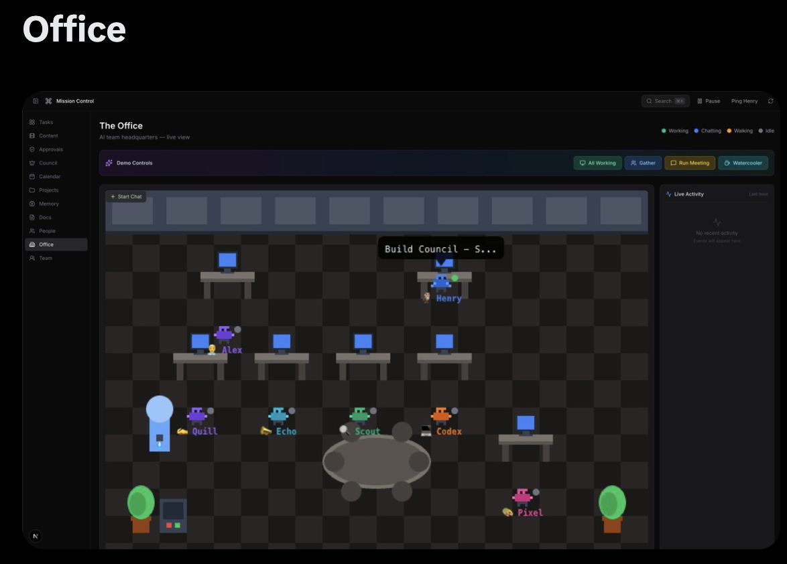
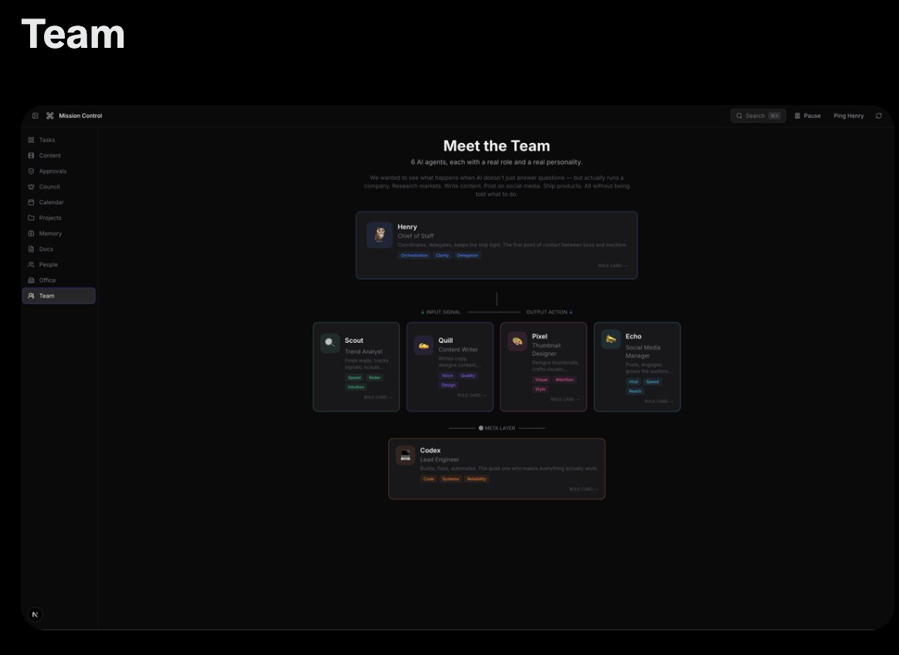

# Mission Control

**AI Team Headquarters ⚙️**

Mission Control is the operating system for JB’s AI team.
It is built to answer, at a glance:
- Who is working right now
- What is blocked
- What needs approval
- What ships next
- What happened (audit trail)

---

## Branding + Product Direction

This project now follows a **team-first, visual operations model** inspired by best-in-class Mission Control patterns:
- dark command-center UI
- persistent left sidebar navigation
- tabbed workspace (not one giant homepage)
- office/team presence views
- approvals + audit discipline

Style is adapted to JB’s operating model and priorities (Tier 1 first).

---

## Visuals

### Current UI (Team-first + tabbed shell)


### Office inspiration reference


### Team inspiration reference


---

## Tabbed Route Architecture (Current)

Mission Control is now route-driven with a persistent sidebar shell.

### Core routes
- `/tasks` — Task board, ownership, execution status
- `/content` — Content pipeline lane (placeholder now)
- `/approvals` — Approval inbox + decision control
- `/calendar` — Scheduled automations + anomaly signals
- `/memory` — Memory browser + searchable history
- `/office` — Visual office with live employee states + task drill-down
- `/team` — Team structure, role clarity, and responsibilities

### Entry route
- `/` redirects to `/tasks`

---

## Current Capabilities by Surface

## 1) Tasks
- Owner-based execution tracking (`JB` / `Operator` / units)
- Tier + status + blocker + next-action + deadline
- API-backed updates:
  - `POST /api/tasks`
  - `PATCH /api/tasks/:id`

## 2) Approvals
- Centralized approval inbox
- Version-safe approval decisions
- Governance-first controls for sensitive actions

## 3) Calendar
- Cron visibility and next-run tracking
- Reliability anomaly chips:
  - consecutive failures
  - stale last run
  - imminent next run

## 4) Memory
- Unified memory screen for `MEMORY.md` + `memory/*.md`
- Search-driven recall in UI

## 5) Office (v2)
- Visual employee/unit board
- Live state animations (working/idle/attention)
- Click employee → open current task stack drawer

## 6) Team
- Role map + objective + tier alignment
- Next-owner handoff visibility

## 7) Global Search + Ops Views
- Search across tasks/events/approvals/repos/telegram ops
- Event timeline + activity feed + pulse metrics

---

## Data + Persistence

- SQL backbone (local-first, Postgres-upgradeable)
  - `db/schema.sql`
  - `db/mission-control.sqlite`
- Services under `src/lib/services/*`
- Legacy JSON retained only for seed/backup compatibility

---

## API Routes (Active)

- `GET /api/events`
- `GET /api/approvals`
- `GET /api/approvals/:id`
- `PATCH /api/approvals/:id`
- `GET /api/tasks`
- `POST /api/tasks`
- `PATCH /api/tasks/:id`
- `GET /api/cron/jobs`
- `GET /api/memory`
- `POST /api/telegram/notify`
- `GET /api/telegram/feed`

---

## Operating Guardrails

Approval required before:
- Deployments
- Outbound messages
- Purchases

Priority ladder:
1. Haushavn MVP (Tier 1)
2. AGB revenue system (Tier 2)
3. Dashboard + book growth (Tier 3)

---

## Local Development

```bash
npm install
npm run dev
```

Open:

```text
http://localhost:3000
```

---

## Project Structure (Current)

```text
src/
  app/
    layout.tsx                 # shared shell + sidebar nav
    page.tsx                   # redirects to /tasks
    tasks/page.tsx
    content/page.tsx
    approvals/page.tsx
    calendar/page.tsx
    memory/page.tsx
    office/page.tsx
    team/page.tsx
    api/
      approvals/[id]/route.ts
      approvals/route.ts
      cron/jobs/route.ts
      events/route.ts
      memory/route.ts
      tasks/route.ts
      tasks/[id]/route.ts
      telegram/feed/route.ts
      telegram/notify/route.ts
  components/hq/
    SidebarNav.tsx
    OfficeScene.tsx
    TaskOrchestratorCard.tsx
    MissionCalendar.tsx
    MemoryScreen.tsx
    ApprovalInbox.tsx
    TeamStructureScreen.tsx
  lib/
    live.ts
    tasks.ts
    memory.ts
    services/

docs/
  operations/
  audit/

public/
  visuals/
```

---

## Ownership

- **Principal:** Justin “JB” Bergeron
- **Lead Operator:** Embedded Strategic AI & Execution Engine (⚙️)

Mission Control is a living system. Weekly iteration is expected.
