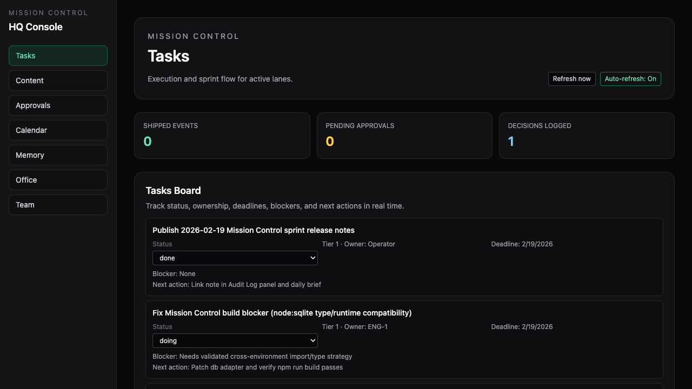
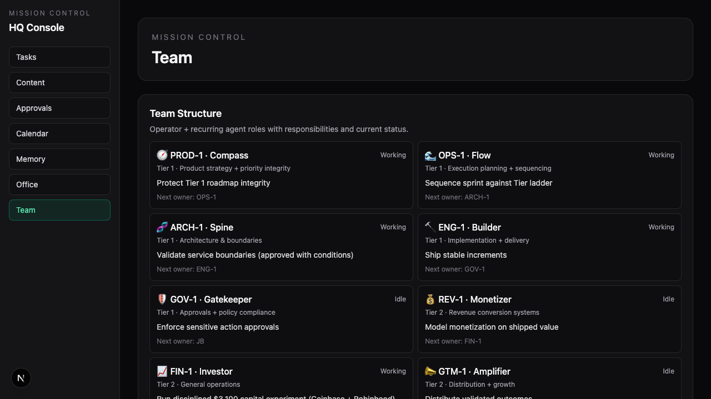

# Mission Control

**AI Team Headquarters ⚙️**

Mission Control is a team-first operating system for AI execution.
It is designed to make work visible, govern risky actions, and keep decisions auditable.

---

## Brand Direction

This repo follows a clean **Mission Control** visual language:
- minimal, futuristic dark interface
- persistent left sidebar navigation
- tabbed workspace (not a single giant dashboard)
- office/team presence views
- high signal, low noise

---

## Visuals (Actual Current UI)

### Tasks


### Office


### Team


---

## Tabbed Route Architecture

Mission Control is route-driven with a shared shell and sidebar.

### Core routes
- `/tasks` — task board, ownership, status, blockers
- `/content` — content pipeline lane
- `/approvals` — approval inbox + decision controls
- `/calendar` — automations + reliability/anomaly view
- `/memory` — searchable memory/doc history
- `/office` — live office scene + task/events/approvals drill-down
- `/team` — team structure and responsibilities

### Entry route
- `/` redirects to `/tasks`

---

## Tier Guardrail Model (Generic)

Use this 3-tier guardrail in any deployment:

### Tier 1 — Reliability & Safety
- Keep system stable
- Prevent risky actions
- Maintain auditability and approval controls

### Tier 2 — Core Execution
- Ship the highest-leverage product work
- Reduce blockers
- Drive measurable weekly outcomes

### Tier 3 — Optimization & Growth
- Experiments, distribution, and incremental improvements
- Only after Tier 1/2 health is acceptable

**Decision rule:** if a task conflicts with Tier 1 reliability/safety, it does not ship.

---

## Current Capabilities

### Tasks
- owner-based tracking
- tier/status/deadline/blocker/next-action fields
- API-backed updates (`POST /api/tasks`, `PATCH /api/tasks/:id`)

### Approvals
- centralized governance queue
- explicit approve/reject flow
- version-safe updates

### Calendar
- cron visibility
- anomaly indicators (failures/stale/imminent)

### Memory
- memory docs browser + search

### Office
- live unit presence with status-driven animations
- click unit to open task/events/approvals context panel

### Team
- role and responsibility map
- handoff visibility

---

## API Routes (Active)

- `GET /api/events`
- `GET /api/approvals`
- `GET /api/approvals/:id`
- `PATCH /api/approvals/:id`
- `GET /api/tasks`
- `POST /api/tasks`
- `PATCH /api/tasks/:id`
- `GET /api/cron/jobs`
- `GET /api/memory`
- `POST /api/telegram/notify`
- `GET /api/telegram/feed`

---

## Operating Guardrails

Approval required before:
- Deployments
- Outbound messages
- Purchases

Hard risk constraints are documented per operational unit/runbook.

---

## Local Development

```bash
npm install
npm run dev
```

Open `http://localhost:3000`

---

## Project Structure

```text
src/
  app/
    layout.tsx
    page.tsx
    tasks/page.tsx
    content/page.tsx
    approvals/page.tsx
    calendar/page.tsx
    memory/page.tsx
    office/page.tsx
    team/page.tsx
    api/
  components/hq/
    SidebarNav.tsx
    OfficeScene.tsx
    TaskOrchestratorCard.tsx
    MissionCalendar.tsx
    MemoryScreen.tsx
    ApprovalInbox.tsx
    TeamStructureScreen.tsx
  lib/
    live.ts
    tasks.ts
    memory.ts
    services/

docs/
  operations/
  audit/

public/
  visuals/
```

Mission Control is a living system. Iterate weekly and keep docs in lockstep with shipped UX.
